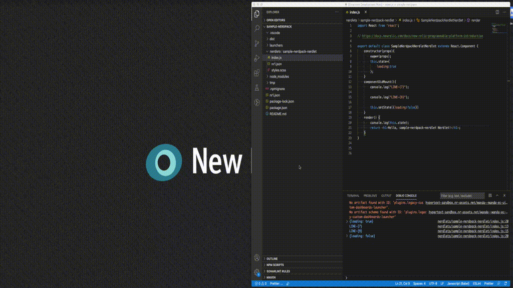

# vsc-nr1-debugger-extension
[]()
[]()

Generate Chrome and Firefox launch configuration for debugging New Relic One applications (Nerdpack).


## Features
Create launch configurations for:

1. Chrome browser
1. Firefox browser


## Requirements
Visual Studio Code Debugger extension:
* [Debugger for Chrome](https://marketplace.visualstudio.com/items?itemName=msjsdiag.debugger-for-chrome)
* [Debugger for Firefox](https://marketplace.visualstudio.com/items?itemName=firefox-devtools.vscode-firefox-debug)


## Installation
1. Open Run/Debug viewlet and select `create a luanch.json file`.
1. Create launch configuration for either Chrome or Firefox from the dropdown  choose either:
```
> NR1: Chrome Launch
  NR1: Firefox Launch
 ```

## Launch Configurations
###  Chrome Browser
```
{
  "version": "0.2.0",
  "configurations": [
    {
      "name": "Nr1: Chrome Launch",
      "type": "chrome",
      "request": "launch",
      "smartStep": true,
      "showAsyncStacks": true,
      "url": "https://one.newrelic.com/launcher/nr1-core.home?nerdpacks=local",
      "pathMapping": {
        "webpack://__nr_modules./[name]/nerdlets": "${workspaceFolder}/nerdlets"
      }
    }
  ]
}
```

### Firefox Browser

```
{
  "version": "0.2.0",
  "configurations": [
    {
      "name": "NR1: Firefox Launch",
      "type": "firefox",
      "request": "launch",
      "reAttach": true,
      "url": "https://one.newrelic.com/launcher/nr1-core.home?nerdpacks=local",
      "pathMappings": [
        {
          "url": "webpack://__nr_modules./[name]/nerdlets",
          "path": "${workspaceFolder}/nerdlets"
        }
      ]
    }
  ]
}

```